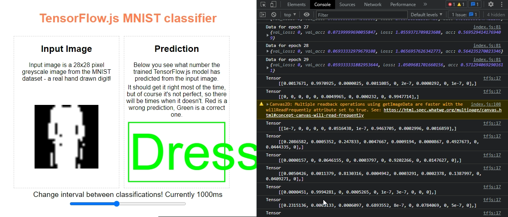

# MNIST Fashion Recognition Using CNN
This is a project for Image recognition using the MNIST dataset. The project is developed using tensorflow js using convlolution Neural Networks. 

## objects Identified
1. T-shirt
1. Trouser
1. Pullover
1. Dress
1. Coat
1. Sandal
1. Shirt
1. Sneaker
1. Bag
1. Ankle boot




## Steps
### Get the inputs and ouputs
fetch the MNIST fashion data
```js
import {TRAINING_DATA} from "https://storage.googleapis.com/jmstore/TensorFlowJS/EdX/TrainingData/fashion-mnist.js"
const INPUTS = TRAINING_DATA.inputs
const OUTPUTS = TRAINING_DATA.outputs
```
### shuffle the data
The input data is shuffled relative to output data
```js
tf.util.shuffleCombo(INPUTS, OUTPUTS)
```
### Normalize the data
Normalize the data to ensure fater processing, input data normalized between 0 and 1
```js
function normalize(tensor, min, max){
  const results = tf.tidy(function(){
    const MIN_VALUES = tf.scalar(min)
    const MAX_VALUES = tf.scalar(max)

    const TENSOR_SUBTRACT_MIN_VALUE = tf.sub(tensor, MIN_VALUES)
    const RANGE_SIZE = tf.sub(MAX_VALUES, MIN_VALUES)
    const NORMALIZED_VALUES = tf.div(TENSOR_SUBTRACT_MIN_VALUE, RANGE_SIZE)

    return NORMALIZED_VALUES
  })
  return results
}
```
### create convolution layer with max pooling
```js
const model = tf.sequential()

model.add(tf.layers.conv2d({
  inputShape: [28,28,1],
  filters: 16,
  kernelSize: 3,
  strides: 1,
  padding: 'same',
  activation: 'relu'
}))
model.add(tf.layers.maxPooling2d({poolSize:2, strides: 2}))

model.add(tf.layers.conv2d({
  filters: 32,
  kernelSize: 3,
  strides: 1,
  padding: 'same',
  activation: 'relu'
}))
model.add(tf.layers.maxPooling2d({poolSize: 2, strides: 2}))

model.add(tf.layers.flatten())
model.add(tf.layers.dense({units: 128, activation: 'relu'}))
model.add(tf.layers.dense({units: 10, activation: 'softmax'}))
model.summary()

```

### Train the data
```js
async function train(){
  model.compile({
    optimizer: 'adam',
    loss: 'categoricalCrossentropy',
    metrics: ['accuracy']
  })

  const RESHAPED_INPUTS = INPUTS_TENSOR.reshape([INPUTS.length, 28, 28, 1])

  let results = await model.fit(RESHAPED_INPUTS, OUTPUTS_TENSOR, {
    shuffle: true,
    validationSplit: 0.15,
    epochs: 30,
    batchSize: 256,
    callbacks: {onEpochEnd: logProgress}
  })

  RESHAPED_INPUTS.dispose()
  OUTPUTS_TENSOR.dispose()
  INPUTS_TENSOR.dispose()
}

```
### Evaluate the data
Evaluate the data using the existing by choosing random inputs and checking the accuracy of the data
```js
function evaluate(){
  const OFFSET = Math.floor((Math.random() * INPUTS.length))
  
  let answer = tf.tidy(function(){
    let newInput = normalize(tf.tensor1d(INPUTS[OFFSET]), 0, 255)
    let output = model.predict(newInput.reshape([1, 28, 28, 1]))

    output.print()
    return output.squeeze().argMax()
  })

  answer.array().then(function(index){
    PREDICTION_ELEMENT.innerText = LOOKUP[index]
    PREDICTION_ELEMENT.setAttribute('class', (index === OUTPUTS[OFFSET])? 'correct': 'wrong')

    answer.dispose()
    drawImage(INPUTS[OFFSET])
  })
}

```
### Use canvas to display the original image
```js
const CANVAS = document.getElementById('canvas');
const CTX = CANVAS.getContext('2d');

function drawImage(digit){
  var imageData = CTX.getImageData(0, 0, 28, 28);

  for(let i=0; i < digit.length; i++){
    imageData.data[i * 4] = digit[i] * 255
    imageData.data[i * 4 + 1] = digit[i] * 255
    imageData.data[i * 4 + 2] = digit[i] * 255
    imageData.data[i * 4 + 3] = 255
  }

  CTX.putImageData(imageData, 0, 0)
  setTimeout(evaluate, interval)
}

```