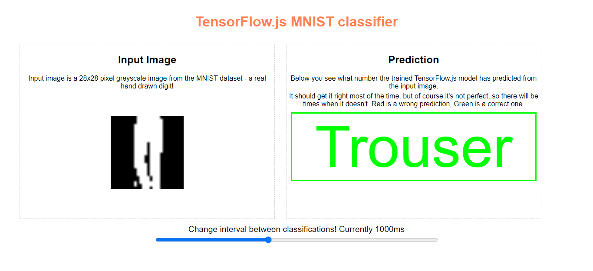
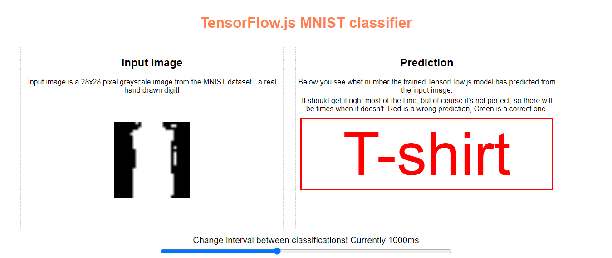
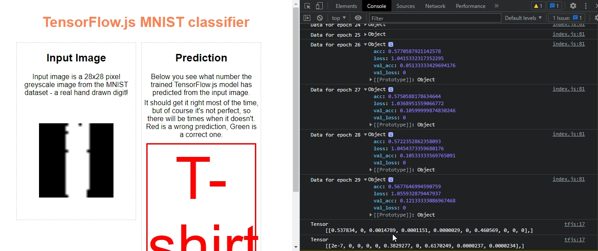

# MNIST Character Recognition Using CNN
This is a project for Image recognition using the MNIST dataset. The project is developed using tensorflow js using convlolution Neural Networks. 

## objects Identified
1. T-shirt
1. Trouser
1. Pullover
1. Dress
1. Coat
1. Sandal
1. Shirt
1. Sneaker
1. Bag
1. Ankle boot

